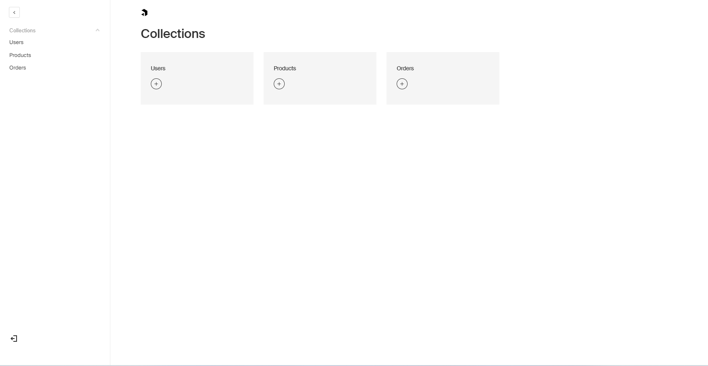
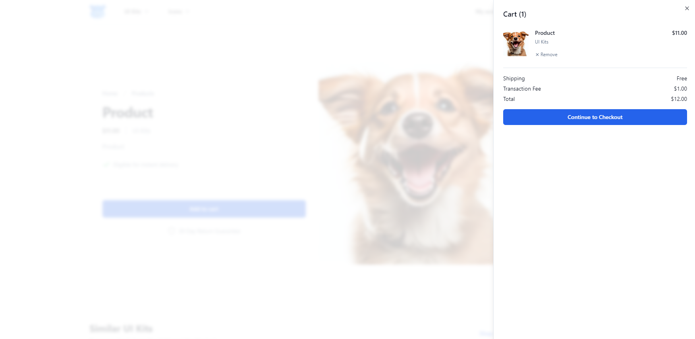
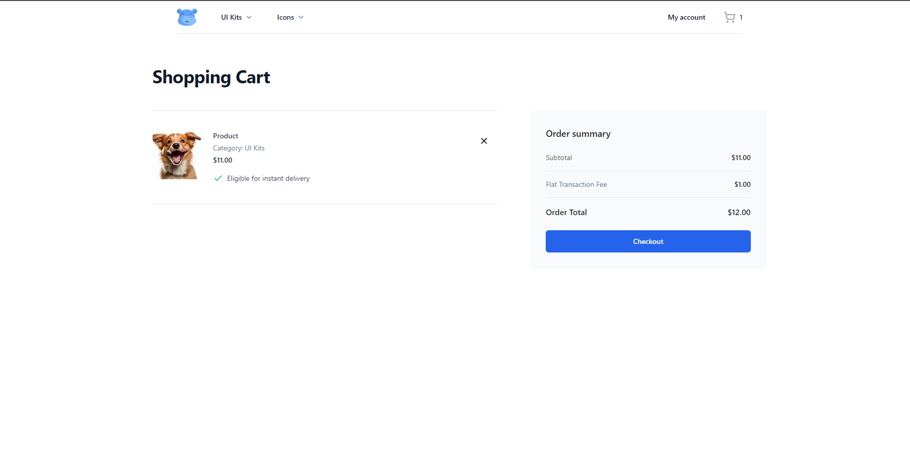
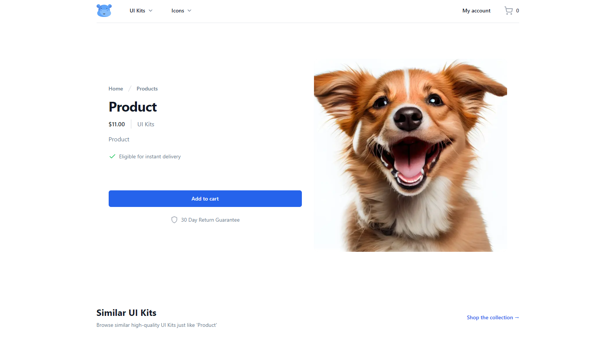
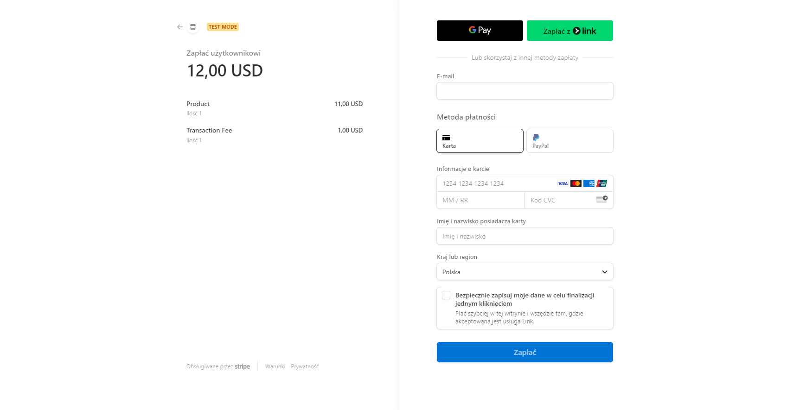
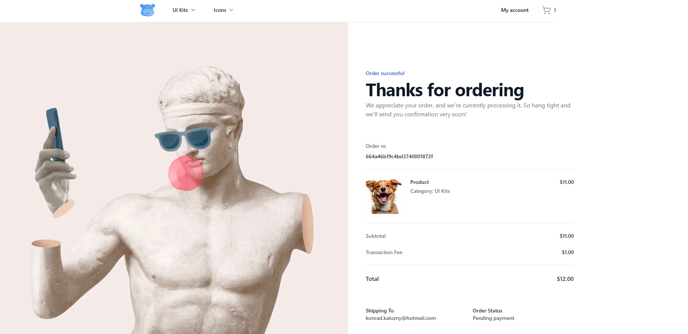

# SassWithMarketplaceNext
Next.js app on Render with Payload, Mongo, Stripe, Resend and custom Auth

https://www.youtube.com/watch?v=06g6YJ6JCJU
https://github.com/joschan21/digitalhippo

# Features
- 🛠️ Complete marketplace built from scratch in **Next.js 14**
- 💻 Beautiful landing page & product pages included
- 🎨 Custom artwork included
- 💳 Full **admin dashboard**
- 🛍️ Users can purchase and sell their own products
- 🛒 Locally persisted shopping cart
- 🔑 Authentication with sign- up verification email
- 🖥️ Learn how to self-host Next.js
- 🌟 Clean, modern UI using shadcn-ui
- ✉️ **Beautiful emails** for signing up and after purchase (Resend)
- ✅ Admins can verify products to ensure high quality
- ⌨️ 100% written in TypeScript

# Examples

# Init steps

1. `npx create-next-app@latest`
2. Add `server.ts` with express for payload
3. Add `payload.config.js` with payload config
4. Deploy app to Render (build commands `npm install; npm run build`, start commands `npm run start`)
5. Init Users collection with mail verification and run `npm run generate:types`
6. Init Shadcn `npx shadcn-ui@latest init` and init some components `npx shadcn-ui@latest add button`
7. Add safety middleware
8. Add auth pages and init resend

## Core Packages to install:
- `express`
- `payload`
- `stripe`
- `nodemailer`
- `zod`
- `zustand`

## Dev Packages to install:
- `@types/express`
- `nodemon`
- `copyfiles`
- `cross-env`
